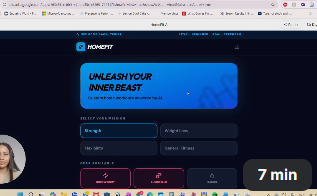

# 🎨 AI-Built Projects (Vibe Coding)
Vibe coding is building apps using AI-assisted tools, you describe what you want, and the tools help bring it to life.
**I had an idea. I figured out the tools. I built it.**
---
## 🏋️ Personal Project — Homefit App
> AI-powered home workout app built to solve a real problem I faced.

  

> 🎬 *Click the image to watch the full walkthrough (7 min demo)*
---
### ⚡ Quick Summary
- 🛠️ Built independently with **Google AI Studio**  
- 🧠 Solves real-world problem: home workouts & form correction  
- 🤖 Features **AI-powered live feedback**  
- ✅ Prototype fully functional & tested  

💡 The Problem

 

- I enjoy working out at home but couldn't tell if I was doing exercises correctly  
- Following YouTube videos wasn't reliable, poor form leads to bad results and injury risk  
- Needed a tool that actually **guided me in real time** and tracked progress  

---

🛠️ How I Built It

 

**Tools & Approach:**  
- Google AI Studio + AI-assisted design tools  
- Adaptive problem‑solving: describe → test → refine → repeat  
- No tutorials, no hand-holding — fully independent build  

**Mindset applied:**  
- Break down problems  
- Test solutions  
- Iterate until functional  

---

⚡ Key Features

 

- 🎯 Generates **custom workouts** based on goals, equipment, time, and fitness level  
- 📸 Shows **correct technique vs common mistakes** side by side  
- 🤖 Includes **live AI coach** that scans your form in real time  
- 🎨 Visual feedback: blue = correct, red = incorrect  
- 📊 Tracks **progress over time** with logs & Hall of Fame  

---

🎯 Results & Impact

 

- ✅ Prototype fully functional & user-tested  
- ✅ AI coach provides **instant feedback**, improving form and reducing injury risk  
- ✅ Allows users to track **real progress over time**  
- ✅ Demonstrates ability to **identify problems, design solutions, and execute independently**  

**Why it matters:**  
- Same mindset applied to IT support: solve real problems, think critically, and follow through until resolution  

---
## 💡 Key Takeaway
- Independently identified a real problem and built a working solution  
- Can explain every decision and tool used  
- Demonstrates **practical thinking, initiative, and follow-through**
