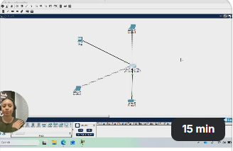

# 🖥️ Hardware & Technical Experience

Real hands-on work. Not theory. Every task here was done, documented, and can be explained step by step.

---

## 📸 Laptop Disassembly & Component ID

> **Device:** Lenovo V14-IGL (Model: 82C2)

> 🎬 *Click the image to watch — I disassemble, identify every component, and reassemble*

📋 What I covered

 

- Pre-disassembly safety checks — powered off, unplugged, face down
- Removed the bottom panel and identified every internal component
- **Battery (35Wh lithium-ion)** — disconnected first to cut all power to the board
- **SSD slot** — where the operating system and files are stored
- **WiFi card** — handles all wireless connectivity
- **Heat pipe** — draws heat away from the Intel Celeron N4020 processor
- **RAM (4GB DDR4-2400)** — soldered directly, cannot be upgraded
- **Motherboard** — identified as the central circuit board everything connects through
- Full reassembly and power on to verify everything was functioning

---

## 🌐 SOHO Network — Problem & Solution

> **Tool:** Cisco Packet Tracer — industry standard network simulation software

> 🎬 *Click the image to watch the full walkthrough — 15 mins*

🔎 The problem, the process, the fix

 

**The Problem:**
A laptop on a SOHO network could not communicate with other devices — caused by an incorrect default gateway. One of the most common issues an IT support technician encounters in the real world.

**What I built:**
- A SOHO network with a wireless router, PC, two laptops and a printer
- Configured the router with SSID, WPA2 security and DHCP

**How I diagnosed and fixed it:**
- Deliberately misconfigured Laptop0 with the wrong default gateway
- Used `ipconfig` to identify the misconfiguration
- Used `ping` to confirm connectivity had failed
- Corrected the gateway and verified connectivity was restored using `ping`

---

## 🛠️ Troubleshooting Log

📄 View troubleshooting log

 

| Issue | What I tried | Outcome |
|---|---|---|
| Laptop0 could not ping PC0 | Checked IP configuration — found incorrect default gateway | Corrected gateway to 192.168.0.1 — connectivity restored |
| Ping to printer timed out | Checked printer IP via Config tab — confirmed DHCP assigned 192.168.0.105 | Identified that Packet Tracer printer blocks ICMP by default — redirected test to router ping instead |

---

