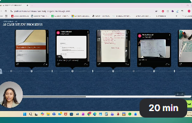

# 🤖 AI Case Study — Charity Automation Project

> This section documents my AI case study, a group project where we were given a real-world scenario and had to design an AI-powered solution from scratch
---

## 🧠 The Brainstorm & Thinking Process

> *Before anything was built, we had to think. This video shows exactly how.*

> 🎬 *Click to watch — 20 mins*

📋 What this video covers

 

A global charity needed to grow but had no marketing team, no budget, and only three staff covering 27 roles each across Australia and New Zealand.

This video walks through how we approached the problem before touching a single tool:

- How we ran a Q&A to understand the client's real situation
- How we mapped out three core problems — inconsistent posting, missed tender applications, and no data visibility
- How we used an LLM to pressure-test our thinking and fill gaps — running each workstream separately to avoid AI errors
- How we applied our own judgement to decide what to build now vs later
- How the manual workflows became the blueprint for the automated solution

---

## 🚀 The Full AI Solution

> *Three workflows. One system. Built to solve a real marketing problem for a resource-strapped charity.*

> 🎬 *Click to watch — 13 mins*

📋 What we built and why

 

**The Problem:**
A global charity operating across Australia and New Zealand with no marketing team, no agency budget, and staff already stretched delivering programmes. Posting was inconsistent, tender applications were written from scratch every time, and there was no visibility into what was working.

**The Solution — three AI-powered workflows:**

| Workflow | What it does |
|---|---|
| 📱 Content Creation & Posting | Staff uploads to OneDrive → n8n picks it up → LLM writes caption → human approves → auto-posts to all platforms |
| 📄 Tender & Awards Applications | New tender triggers n8n → pulls past examples → AI drafts application → human reviews → sends via Outlook |
| 📊 Data & Analytics | Schedule trigger → pulls platform data → AI Studio analyses → report delivered to staff automatically |

**Tools used:** n8n · Google AI Studio · NotebookLM · Agentic AI · Microsoft 365 · Stitch · Azure OpenAI

**My role:** Part of a four-person team. Contributed to the brainstorm, workflow design, and the analytics workstream.

---

## 💡 Key Takeaway

This wasn't a classroom exercise. We designed for real constraints — a Privacy Act, a Microsoft-only ecosystem, three overwhelmed staff, and zero budget. Every decision had a reason. That's the difference between knowing a tool and knowing how to think with it.
