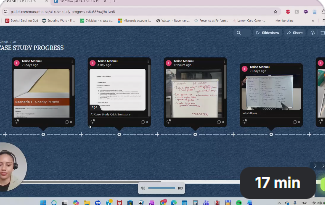

# 🎤 Presentations

This section documents my AI case study presentation and video walkthroughs.

---
## 🎬AI Business Case Study (Loom Video)

A video walkthrough of the thinking behind the solution — the why behind
every decision, the manual workflow before automation, and the tech mindset
applied throughout.

---

## 🤖 AI Business Case Study — Global Charity Automation

A group project presenting an AI-powered solution for a global charity
operating across Australia and New Zealand.

**The Problem:**
The charity had no marketing team, no agency budget, and staff already
stretched delivering programmes. Marketing was inconsistent, posting was
ad hoc, and funding opportunities were being missed due to manual tender
and awards applications.

**The Solution:**
An AI-powered workflow built across three pillars:
- Content creation and social media posting
- Tender and awards application automation
- Data and analytics dashboards

**Tools used:** n8n, AI writing tools, Microsoft 365, cloud storage

---

## 💡 Key Takeaway

Every presentation here demonstrates not just what was built, but why every
decision was made. That is the difference between knowing a tool and knowing
how to think with it.
