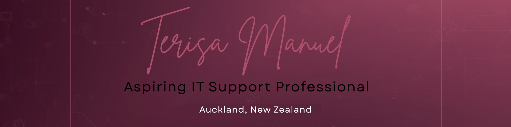

# Terisa Manuel — Tech Portfolio

**Aspiring IT Support Professional · Auckland, New Zealand**

---

💫 Who I am

 

Hey, I'm Terisa 👋

A Cook Island woman born and raised in Auckland, NZ. I come from a hospitality background and I made a deliberate decision to pivot into tech. Not because it was easy, but because I wanted to challenge myself, grow in a real direction, and build a career I'm genuinely excited about.

I got into IT because I love helping people and I love solving problems. Those two things have always been my thing, whether it was in hospitality or now behind a screen.

> *"The moment IT really clicked for me was sitting in class, staring at a problem I had no idea how to solve and then figuring it out anyway. That feeling? That is exactly why I am here."*

---

🔥 What I bring to the table

 

I'm actively looking for an entry-level role in IT support — help desk, service desk analyst, or IT support technician.

What I bring isn't just technical knowledge. It's the ability to stay calm when things break, explain complex issues in plain language, and follow through every single time. I've built that through years in hospitality and proven it through everything in this portfolio.

- 🛠️ **Hands-on technical skills** — hardware, networking, troubleshooting
- 🤖 **AI and automation** — designing and building real workflows using n8n and LLMs
- 💬 **Communication** — I can explain technical issues to anyone, technical or not
- 🧠 **Problem-solving mindset** — systematic, calm, and curious

---

🌟 What makes me different

 

I don't have a university degree. What I have is better — real projects, real problems, and real solutions I built myself.

- **Communicator** — I explain technical issues in plain language to anyone, technical or not
- **Reliable** — I show up, I get it done, and I follow through every time
- **Calm under pressure** — when something breaks, I stay focused and work the problem
- **Curious** — I always want to understand how things work, not just that they work
- **Detail-oriented** — I care about doing things properly and I don't cut corners

---

📂 What I've built

 

| Section | What's inside |
|---|---|
| [🚀 Homeift App — Vibe Coding](./02-projects/) | A personal AI-powered home workout app I built from scratch |
| [🖥️ Hardware & Networking](./03-hardware/) | Laptop disassembly, Cisco Packet Tracer SOHO network, troubleshooting log |
| [🤖 AI Case Study](./04-presentations/) | Group AI solution built for a real global charity using n8n and automation |
| [📝 Reflections](./05-reflections/) | What I learned, what tested me, and where I'm headed |

---

💬 Let's connect

 

- 🐙 GitHub: [github.com/TerisaManuel](https://github.com/TerisaManuel)
- 💼 LinkedIn: [linkedin.com/in/terisa-manuel](https://www.linkedin.com/in/terisa-manuel-03b16a3b1/)

